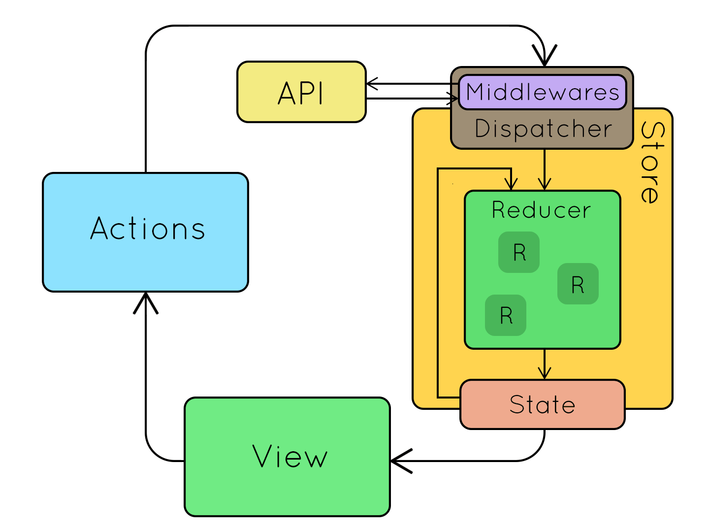

# Flux

Flux is not a library or framwork it is simply a pattern in which to structure your applciation.
It doesnt necessarily need to be used with react

Flux is also created by facebook.

## Action
An action being the flow of data in  flux. An actions `type` indicates the type of change to be perforemed one the applciations state. It can also contain additional information called "payload".

## Dispatcher

It is a mechanism for distributing(or "dispatching") actions to the a flux applciations store

## Store

The store represents the entiree state of the application. It is also responsible for the state of the applciation appropriately whenever it receives an action.


## View

A view is a unit of code thats responsible for rendering the user interface. To fully complete the flux pattern, a view listens to change events emitted by the "store"

## Flux Pattern


# Redux


Now redux is a library that implements a particular side of flux pattern.
There are some differences between flux and reduX. But redux still uses three important principles.

1.  **__Single Source of truth__** : The entire state of the application is stored in a single js object. This object is also called a "state tree".

2. State is Read Only. the only way to change the state is to dispatch an action
3. Only pure functions change state: pure functions know as "reducers" receive the previous state and an action and return the next state.



## Redux Store

This holds the global state of the application. The store is also responsible for updating the global satte via its reducer.

### Managing State

---
The store manages the global state of the application. You should only read and update the global state thorugh t the store

#### The store is responsible for:

1. Returning the current stae
2. Updating the state
3. Notify the subscribed componets (call functions) whenever the state gets updated

## Store APi

A redux store has three methods: geState(), dispatch(action), subscribe(callbacks)

### STORE Methods

the `getState()` method returns the stores current state
the `dispatch(action)` method passes an actioninto the stores reducer telling it what information to update
`subscribe(callback)` - register a callback to be triggered whenever the tore updates. Returns a function which when invoked unsubscribes from the the callback function from the store.


### Creating the store
The redux library provides us with a `createStore()` method, which takes up to three arguments and returns a Redux store.
``` js
import { createStore } from 'redux';

const store = createStore(reducer, preloadedState, enhancer);
```

1. `reducer (required)` - A reducing function that receives the store's current state and incoming action, determines how to update the store's state, and returns the next state (more on this in a moment).


2. `preloadedState (optional)` - An object representing any application state that existed before the store was created.
enhancer (optional) - A function that adds extra functionality to the store.

3. `enhancer (optional)` - A function that adds extra functionality to the store.


## Updating the store
Store updates can only be triggered by dispatching actions:

`store.dispatch(action);`

An `action` in Redux is just a plain-old JavaScript object (POJO) with:

    a type key indicating the action being performed, and

    optional payload keys containing any new information.


For example, you would use the following addOrange action to add an orange to the store's state. Notice how it has a type of 'ADD_FRUIT' and a fruit payload of 'orange':
``` javascript
const addOrange = {
  type: 'ADD_FRUIT',
  fruit: 'orange',
};
```
Any action that gets dispatched will be passed into the store's root reducer. A reducer is a function that accepts the current state and an action and determines how the next state will look like based on the action.
